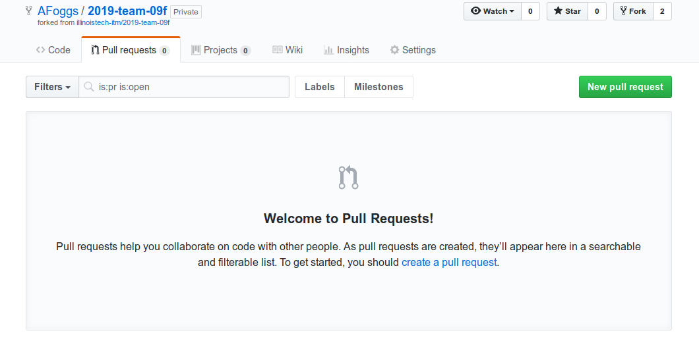

# 2019-team-09f

Private team repo for ITMT 430

## Github Guidelines

For GitHub, we should all fork the team repository and set the primary repo as a remote repository. Any changes we make to our code should be pushed locally and then changes should be merged with a majority consent on GitHub. This should cut down on the amount of merge conflicts and allow us to all work faster without much worry of destroying the project accidentally, or accidentally uploading unnecessary files.

-Antoine

### Developmental Tools on Client needed
- Latest version of Node
- Latest version of Virtual Box (Recent Version not available via Linux Package Manager. Must be manually installed)
- Latest version of Packer
- Latest version of Vagrant
- Text Editor of Choice (Atom/Visual Studio Code Recommended)
- HTML Lint Global Install Latest Version
- CSS Lint Global Install Latest Version
- ES Lint Global Install Version 5.12.0
- MongoDB For Local Machine Test
- Git Latest version
- pm2 Latest version Local Test

### Communication tools on Client needed
- Slack, Desktop Version (Alerts you to changes)
- Trello, Desktop Version (Unavailable on Linux)

### Additional Optional Developmental Tools
- HTTP-Server for any local test.
- Package Manager (Chocolaty Recommended)

#### Forking Tutorial

First, Fork the team repository so that you have a personal copy. It is the button labeled fork on the upper right hand corner.


Next, in the newly forked Repo, copy the clone text and clone your personal repository.


After cloning the repository, enter the following commands so that you can set up your remote repository and team one.

```
git remote add origin https://github.com/user/repo.git //This is your repository
git remote set team https://github.com/user/repo.git //This is the group repository
git remote -v //Verify your Repository
```

Your output should look something like this.

```
origin	git@github.com:AFoggs/2019-team-09f.git (fetch)
origin	git@github.com:AFoggs/2019-team-09f.git (push)
team	git@github.com:illinoistech-itm/2019-team-09f.git (fetch)
team	git@github.com:illinoistech-itm/2019-team-09f.git (push)
```

After this, your environment is set up properly.

**_Before_** you do work, run this command:

```
git pull team master
```

This ensures that you have the most up to date repository that you're doing work on.

Once you have finished doing work for the day, push your code to your private repository. Once you are ready to combine your code, go to your personal repository, go to pull request, and hit new pull request.



Next you select create pull request


And Then create the title and comment.


Lastly, let your teammates know. Once at least 2 people have commented and saw that the code looks good, anyone may merge the pull request.


## Home System File install

(Add Linting, Vagrant, Etc.)

## Project Idea & Outline

We are the _Slayers_, and our idea is to create a modern real estate application that uses a modern UI to easily connect potential buyers/tenants with sellers/landlords and other roommates.

### Overall idea

The overall idea is to enable everyday users on the application to be able to rent and buy real estate of all sorts. _i.e. Apartments, Condos, Homes, Etc._

This particular real estate app will be focused on using a 'Tinder' swipe and match concept. Instead of 2 individual people matching however, it is the user (you) matching with a listing property that you **like,** essentially being able to swipe until you find your perfect new home with a more user friendly and holistic experience.

Filtering is going to be our focal point. Showcasing a concrete step by step process is going to differentiate us from other platforms. Furthermore, adding a **ROOMMATE** feature will help differentiate us even more. This can be under the RENT selection of which the user will choose.

```
E.G. MASTER ------------> SPECIFIC

RENT or BUY
    |            |
    |       Specific filters (Beds, baths, sqft, price range , etc.)
    |
Roommate (Y/N)?
    |
Specific filters
```

## Building project

### First generate an rsa key

1. [Generate a new ssh key](https://help.github.com/articles/generating-a-new-ssh-key-and-adding-it-to-the-ssh-agent/#platform-linux)

2. Add your deploy key to your to this repo's settings by coping your \*.pub file

### Build vms

1. Make sure your have already forked and clones this repo
2. cd into the project
3. Add you rsa private key in the node-application-server directory

   

4. Install Vagrant Plugin:

```
vagrant plugin install vagrant-vbguest
```

5. Run build script:

```
bash bulid-everything.sh
```

### Team Member Introductions

#### Antoine Foggs

Hey, everyone! We all more or less know each other, but I still believe we should do an introduction. I'm used to working with git, and I have some experience working with vagrant already, as well as some cloud services. In regards to programming, I am capable but it isn't my strong suit. I am great at managing projects and understanding how to integrate different technologies together. I also don't mind trouble shooting and learning whatever is needed to be helpful.

Feel free to visit my [Github](http://www.github.com/Afoggs) to see some of the work I've done.

#### Theo Economos

#### Jarron Bailey

#### Erick Cabrera

#### Johnathan Garcia

#### Giancarlo Barillas
