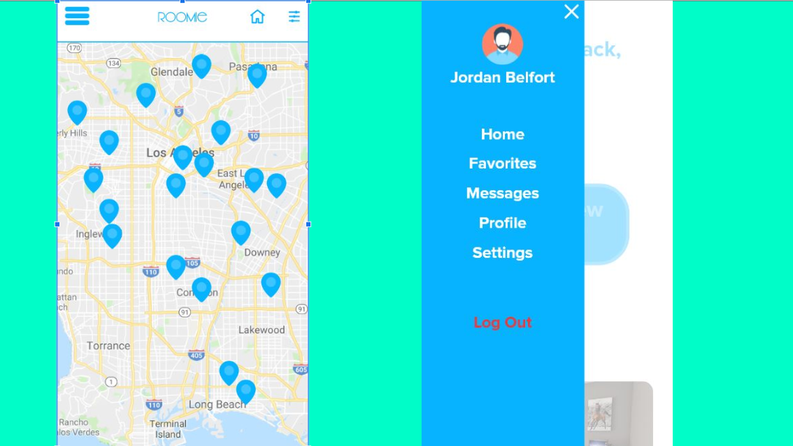

# Sprint 2 Report

## Roles

- Project Manager - [Jarron Bailey](https://github.com/jarronb)
- Lead Developer - [Giancarlo Barillas](https://github.com/giancarlobarillas)
- Junior Developer - [Johnathan Garcia](https://github.com/)
- UI/UX - [Theo Economos](https://github.com/teconomo), [Erick Cabrera](https://github.com/ecabrera796)

We have spent the majority of this sprint focusing on building tangible designs and artboards through Adobe XD. We also have utilized our user tree flow to implement our designs in a workable prototype to showcase a demo type of our app. 

- IT Operations - [Antoine Foggs](https://github.com/AFoggs)

## Sprint 2 Goals

Our goal for sprint two was to finalize the core design for the application, as well as ensuring that our production environment was able to successfully deployed on all system types. As such, our goals reflect our overall desire to achieve this in the second sprint.

- Mockup designs for web application
- Build fundamental infrastructure
- Configured build process to successfully build out servers
- Port forwarding from host to virtual machine to allow access
- Created MongoDB Atlas account
- Implement database functionality
- Create logic for switching node application environments
- Decide on database Schemas
- Research encryptions for Login page

## Completed Goals

- Mockup designs for web application *included below*
- Built Fundamental Infrastructure
  - Nginx reverse proxy web server
  - Node application server
  - MongoDB database server
- Configured build process to successfully build out servers
  - Application can run in development environment or production environment
- Port forwarding forwarding from host to virtual machine to allow access
- Created MongoDB Atlas account
  - Online database is used when Node environment is in "development mode, makes running the web app locally easier for hot reloading purposes. The changes between development or production environment is the MongoDB connection string and the host IP address which is is the environment variables.
- Implemented database functionality
  - MongoDB sever has been implements and communicating with node application for saving of documents
- Created logic for switching node application environments

This sprint, the sum of our goals alleviated the bulk of issues that we would potentially face when making changes to our code in the production environment. In this process, there were a significant amount of issues that we faced, primarily in successfully building out our environment. Dozens of hours was spent debugging, however we have compiled a large list of errors and solutions, which will be added to a file after being properly documented. As such, we've reduced the amount of time spent debugging issues with our production environment in the future, allowing us to focus solely on improving the product.

## Current Designs

## Current Architecture

## Sprint 3 To-Do

- Configure Node environment with [pm2](http://pm2.keymetrics.io/)
  - pm2 is an advanced process manger for Node.js with a built in load balance. It allows you to keep applications alive forever, to reload them without downtime and facilitate common Devops tasks.  
    
- Database Schema Creation
  - Decide on database Schema and input types
- Login authentication with [Passport.js](http://www.passportjs.org/)
  - Passport.js is a middleware for Node.js that can be used for many authentication methods such as Google, Facebook, Twitter, or Local Strategies
- Set-up slave database
- Create self-signed certs for Nginx web server
- Continue to improve designs
- Deploy Version 1.0 of the application with core functionality
  - HTML Files
  - CSS Files
  - JS Files

In the next sprint, we will focus on implementing security and ensuring data integrity in our project. With a now stable production environment, we want to ensure that is is secure as early as possible so that there is no need to compromise security in order to implement features. By implementing the important features early, we can reduce our production time for implementing new changes.

Since the hardest part of the design element was creating the UI, we decided against implementing the front end originally. Now that our front end has been designed, and the majority of the back end deployed, in this sprint we will create the front end with the core design elements. We will decide on our ids and classes that will be mapped to the front-end and back-end.

### Team Members

[Antoine Foggs](https://github.com/AFoggs)

[Theo Economos](https://github.com/teconomo)

[Jarron Bailey](https://github.com/jarronb)

[Erick Cabrera](https://github.com/ecabrera796)

[Johnathan Garcia](https://github.com/)

[Giancarlo Barillas](https://github.com/giancarlobarillas)
