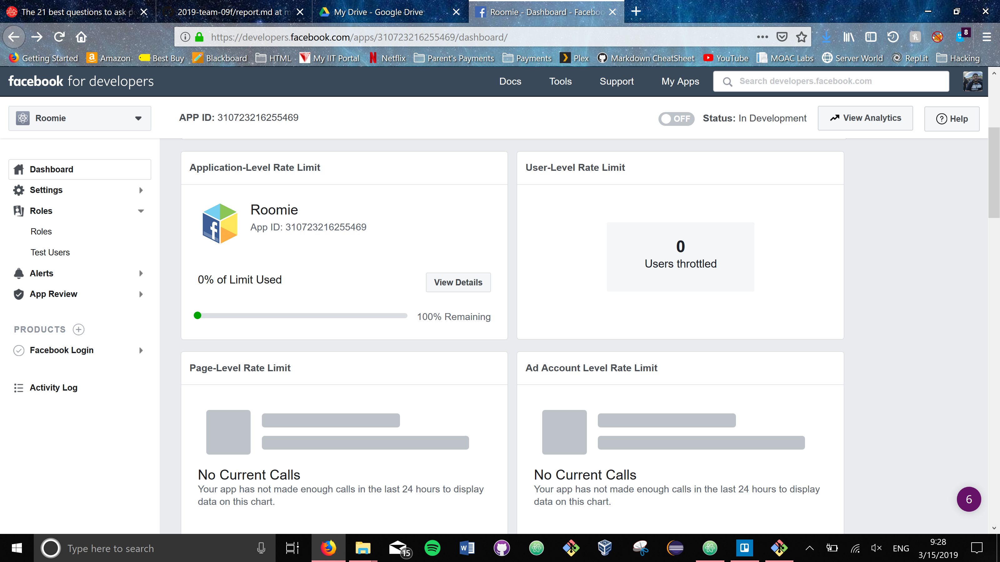
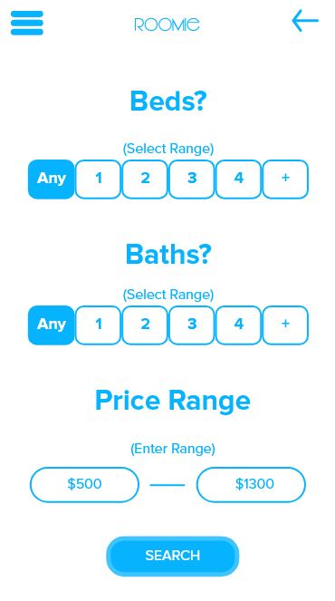

# Sprint 3 Report

## Roles

- Junior Developer - [Jarron Bailey](https://github.com/jarronb), [Theo Economos](https://github.com/teconomo)
- Lead Developer - [Giancarlo Barillas](https://github.com/giancarlobarillas), [Antoine Foggs](https://github.com/AFoggs)
- UI/UX - [Johnathan Garcia](https://github.com/)
- Project Manager - [Erick Cabrera](https://github.com/ecabrera796)

## Sprint 3 Goals

Our goal for Sprint 3 was to finalize all that we need to start making our artboard designs come to life. We wanted to ensure we implement security now so we could have it ready for when we start creating our web pages. We also wanted to have our database schema drawn out so we could start building the database and populate it as we are building the web pages.

- Configure Node environment with [pm2](http://pm2.keymetrics.io/)
  - pm2 is an advanced process manger for Node.js with a built in load balancer. It allows you to keep applications alive forever, to reload them without downtime and facilitate common DevOps tasks.  
    
- Database Schema Creation
  - Decide on database Schema and input types
- Login authentication with [Passport.js](http://www.passportjs.org/)
  - Passport.js is a middleware for Node.js that can be used for many authentication methods such as Google, Facebook, Twitter, or Local Strategies
- Set-up slave database
- Create self-signed certs for Nginx web server
- Continue to improve designs

## Completed goals

- Build project environment on all machines
  - We started off Sprint 3 by ensuring that our product environment successfully built on all of our machines.
- Configure Node Environment
  - We decided to use pm2 to help us manage our node environment and facilitate our DevOps tasks.
- Database Schema
  - We took a closer look at how we are going to set up our database and seeing which types of entries we would need. We carefully came up with our schema making sure to keep the database clean, organized, and have little to no redundancy so that we could start building out our database as we are creating the web pages.
  
- Security
  - We decided to utilize Passport.js to help us set up our login authentication. We are going with both local authentication as well as Facebook authentication. We also created accounts with Facebook for Developers to help with our Facebook authentication.
  
- Slave database
  - With utilizing MongoDB, we learned that they disabled traditional Master/Slave relationships as of their 3.4 Versions. Instead, it has been replaced with replica sets. We are finalizing the last test before adding it live, utilizing one DB as the primary(master) and two others as secondary (the slaves).
- Self Signed certs for Nginx Web server
  - We utilized CertBot to generate a self-signed certificate for our project. In addition, we also changed the permissions of our web server to redirect all http traffic to https, and are working to force https traffic only.
- Improved designs
  - Last week we received feedback on making a type of side swipe option button when it came to selecting the number of beds, baths, etc. However, we decided it was best to keep it this way because we will offer the choice for a user to select multiple options so that those options come up in their search. For example, if I want to look for an apartment with 2 baths, but I would also be open to finding one with 1 bath, then I have the option to select both the 2 and the 1 option so my search will be populated by both.
  

For this Sprint we focused heavily on the remaining components we need to finally be able to set up our web pages and begin populating our database. After countless attempts and numerous debugging, We were finally able to get the product environment up and running on all of our machines. When it came down to setting up our database schema, it took a while to make sure we were making the database entries as clear as possible. We wanted to avoid doing extra work by having multiple entries that basically stored the same information for different users. Instead, we made it so an entry would have information that multiple users can access.

## Sprint 4 To-Do

- Deploy Version 1.0 of the application with core functionality
  - HTML Files
  - CSS Files
  - JS Files
- Populate database and begin to run test users
- Implement login authentications
- Create list of roommate compatibility questions

Now that we are done with getting everything ready for our web pages, for the next sprint we will be heavily focusing on creating and deploying our web pages. At the same time, we will be setting up test users and populating our database to make sure everything is connecting properly. Also, we will be testing out our login authentications and ensuring the Facebook authentication is functioning correctly. On the side, we are starting to think about how the roommate part of our product will have the most success. We came up with the idea to have a quick compatibility questionnaire to ensure you are being matched with good candidates to be your roommate. We hope this would attract more people to give our product a try.

#### Team Members

[Antoine Foggs](https://github.com/AFoggs)

[Theo Economos](https://github.com/teconomo)

[Jarron Bailey](https://github.com/jarronb)

[Erick Cabrera](https://github.com/ecabrera796)

[Johnathan Garcia](https://github.com/)

[Giancarlo Barillas](https://github.com/giancarlobarillas)
