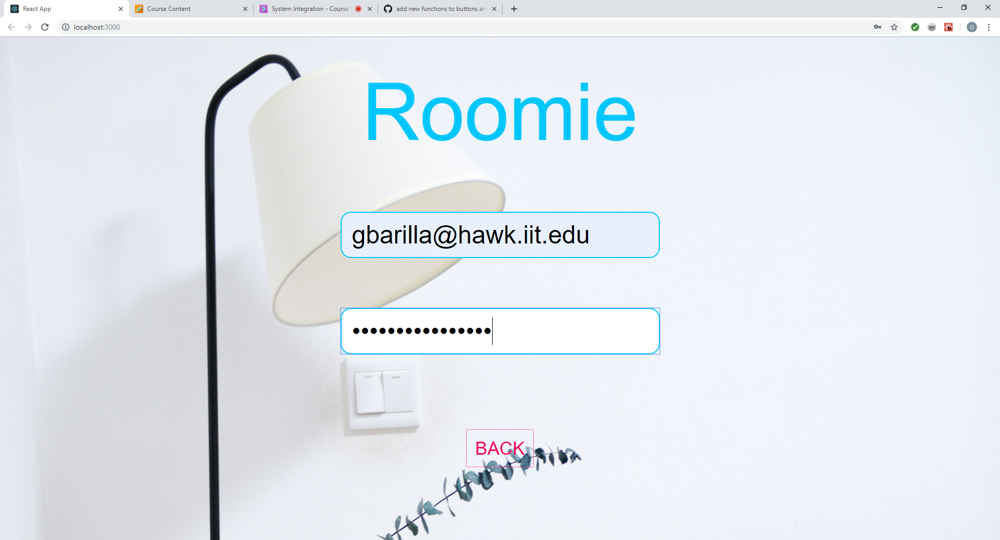
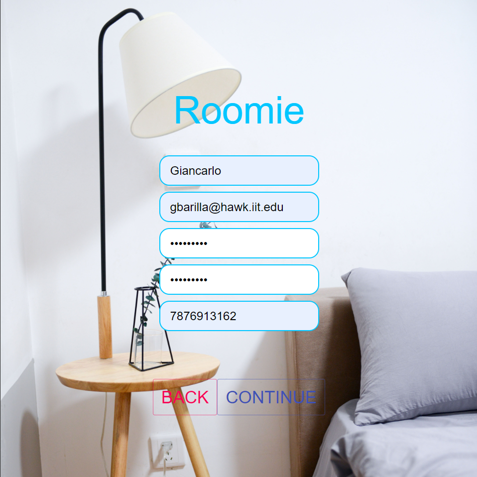
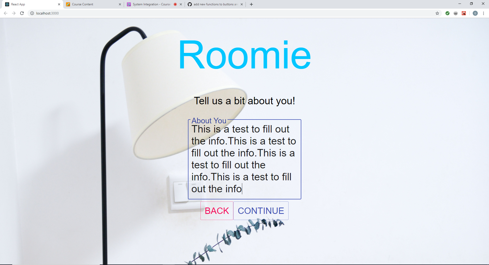
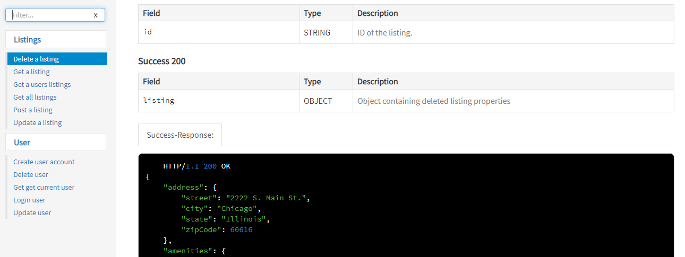
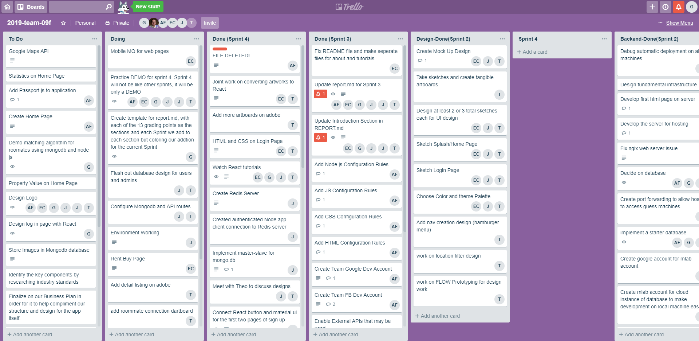
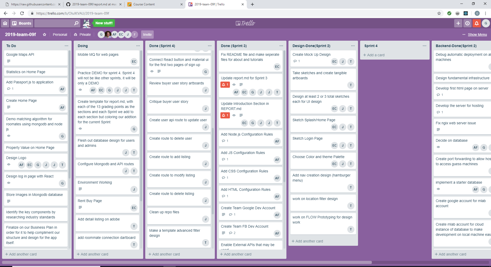
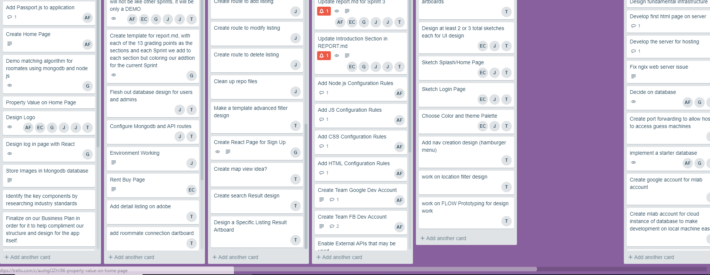

# Sprint 6 Report

## Project Overview

## Roles

- Junior Developer - [Giancarlo Barillas](https://github.com/giancarlobarillas), [Johnathan Garcia](https://github.com/)
- Lead Developer - [Erick Cabrera](https://github.com/ecabrera796)
- UI/UX - [Jarron Bailey](https://github.com/jarronb)
- Project Manager - [Antoine Foggs](https://github.com/AFoggs)
- IT Operations - [Theo Economos](https://github.com/teconomo)

## Sprint 5 Goals

<!-- The goal of this sprint was to create a foundation for building and maintaining React components. We want to finalize all key wireframes for this sprint and how they should look like so that we have a template to build off of. The goals from the class were to create a user and go through the process of 1 key functionally of the application -->

## Completed goals

<!-- Design primary artboards on adobe

- The designs for the process of viewing potential properties has created and the artboards have been uploaded to GitHub
  Design the primary CSS for all react components
- The primary CSS file has been created and is currently on github. This CSS hold the styling for the template that we will use throughout the application.
  Begin designing React Components
- Currently we were able to design the following react components
  
  
  
  
  - LoginButtons: which are displayed when the user opens the application
  - Sign up form: which displays when the user selects sign up. Currently the application can switch between this component and the LoginButtons component.
  - Log in Form: This component is used when the user wants to log in to their account
  - About Me: This page deals with the about me component
    We were able to continue building the servers
- We were able to create a Redis server
- Connect authenticated node app client to connect to Redis server
  Design API’s for adding user to mongodb database
  
- This is split into two parts Users and listings
- The list of listings api goes as follows:
  - Delete a listing
  - Get a listing
  - Get a user listing
  - Post a listing
  - Update a listing
- The users list of apis goes as follows:
  - Create a user account
  - Delete user
  - Get current user
  - Login user
  - Update user
    Connect material ui to help create more responsive buttons and formatting -->

## Final To-Do

<!-- For the upcoming spring we will try to complete the following:

- Connect all react components to their proper buttons and functions
- Connect forms to post to the api and create a user
- Create React component for the listings that a user can see
- Create React component for the Leasing Agents if they are selling a property
- Experiment with saving images onto mongodb

For the following sprint the goals that we have placed for ourselves is to connect the api calls to the React components. This will help us make the application interact with the mongodb database. We will also need to test the database for injections and ensure that the api call are secure. -->

## Sprint 6 Rubric Info

1. The language we are using is Javascript
2. The operating system that we are using is Linux and Windows for development. We have some developers that are using Linux as their native development envirment and current we have implemented a npm linux start for the react application. The frameworks that we are using are Node js and React js. We are using node to build the application and routing while we are using react to build the components of the application
3. The database that we are using is Mongodb
4. The Data encryption at rest os JWT
5. We have disabled master/slave relationships in favor of replica sets. We are using a redis caching server. We are also using api that can manage the call to the database
6. We are using React js to manage responsive design and we recently connect to material ui to manage buttons and any componenet elements
7. We do have self signing cert with CertBot to generate a self signed certificate. We have change the permissions of the web server to change to https.
8. We have will have to manage the user authentification and currently we have implemented authenticated for the servers and the API calls will check the authentification of the calls.
9. Our development enviroments are done by running the npm start dev from the server. The server is located in the app folder. Once this is running we are allowed to see the react application
10. All our designs can be seen in the design files along with the video of the application
11. Currently our flowcharts of the application are in the reports and in the images folder. These contain the current database relationships.
    
12. Our trello is currently accurate with the completed tasks.
13. Currently we have not implemented our 14 test data since we need to first completely connect the api calls to the react components.

## Trello Board

<!-- 

 -->

#### Team Members

[Antoine Foggs](https://github.com/AFoggs)

[Theo Economos](https://github.com/teconomo)

[Jarron Bailey](https://github.com/jarronb)

[Erick Cabrera](https://github.com/ecabrera796)

[Johnathan Garcia](https://github.com/)

[Giancarlo Barillas](https://github.com/giancarlobarillas)
